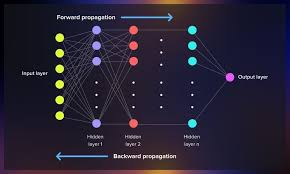

# Back-Propagation

## Table of Contents
1. [Introduction](#introduction)
2. [History](#history)
3. [Significance](#installation)
4. [Usage](#usage)
5. [Dataset](#dataset)
6. [Model](#model)
7. [Results](#results)
8. [Contributing](#contributing)
9. [License](#license)
10. [Contact](#contact)

## Introduction
- Backpropagation, short for "backward propagation of errors," is a technique used in training artificial neural networks (ANNs) by adjusting weights and biases to minimize the difference between the predicted output and the actual output.
- It forms the backbone of many modern machine learning algorithms, enabling neural networks to learn from their mistakes and improve their performance over time.

## History
- 1970s: The concept of backpropagation began with the work of Paul Werbos, who introduced the idea of using gradient descent for training neural networks in his 1974 PhD thesis.
- 1980-1990s: 

## Significance

1. Tranning Deep Neural Netwok
2. Foundation of Deep Learning
3. Optimization
4. Scalability
5. Efficient Training
6. Versatility

## Architecture

