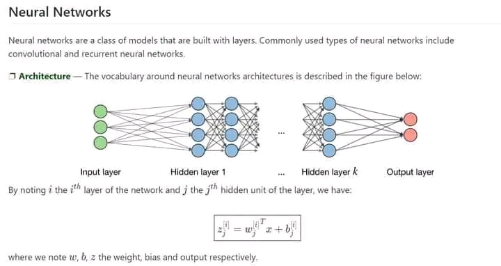
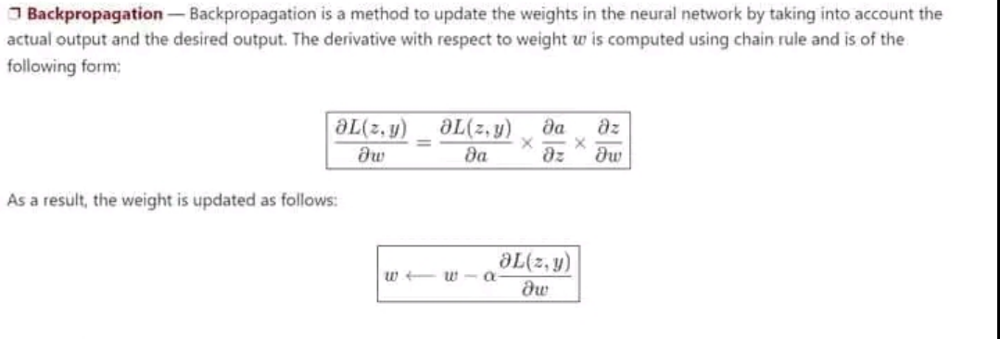

# Back-Propagation

## Table of Contents

- [Back-Propagation](#back-propagation)
  - [Table of Contents](#table-of-contents)
  - [Introduction](#introduction)
  - [History](#history)
  - [Significance](#significance)
  - [Architecture](#architecture)
  - [Mathematical Model](#mathematical-model)
    - [Learning Rate](#learning-rate)
    - [Backpropagation](#backpropagation)
    - [Updating Weights](#updating-weights)
    - [Dropout](#dropout)
  - [Algorithm](#algorithm)
    - [Steps of Backpropagation](#steps-of-backpropagation)
  - [Application Of Neural Network](#application-of-neural-network)

## Introduction
- Backpropagation, short for "backward propagation of errors," is a technique used in training artificial neural networks (ANNs) by adjusting weights and biases to minimize the difference between the predicted output and the actual output.
- It forms the backbone of many modern machine learning algorithms, enabling neural networks to learn from their mistakes and improve their performance over time.

## History

- **1986:** The modern form of backpropagation was independently developed by multiple researchers, including Geoffrey Hinton, David Rumelhart, and Ronald Williams. This version significantly improved training efficiency by introducing techniques to efficiently compute gradients in multilayer neural networks.

- **1990s-2000s:** Backpropagation continued to evolve with advancements in computational power and algorithmic improvements. Researchers explored variations such as stochastic gradient descent (SGD) and adaptive learning rate methods to enhance training efficiency and convergence speed.

- **2010s-present:** Backpropagation remains a cornerstone of deep learning, enabling the training of complex neural network architectures on large datasets. Recent developments have focused on mitigating issues like overfitting through regularization techniques (e.g., dropout, batch normalization) and exploring alternative optimization algorithms (e.g., Adam, RMSprop).

- **Future Directions:** Ongoing research aims to address remaining challenges in backpropagation, such as its vulnerability to vanishing and exploding gradients in very deep networks. Techniques like residual connections, attention mechanisms, and advanced optimization strategies continue to push the boundaries of what neural networks can achieve.

## Significance
1. Training Deep Neural Networks
2. Foundation of Deep Learning
3. Optimization
4. Scalability
5. Efficient Training
6. Versatility

## Architecture

## Mathematical Model

### Learning Rate
- **Definition**: The learning rate, denoted as 'α' or sometimes 'η', controls how much the weights of the network are adjusted with respect to the loss gradient.

### Backpropagation

### Updating Weights
1. **Step 1**: Take a batch of training data.
2. **Step 2**: Perform forward propagation to calculate the loss for each data point in the batch.
3. **Step 3**: Apply backpropagation to compute the gradients of the loss with respect to each weight.
4. **Step 4**: Update the weights using the calculated gradients to reduce the loss.

### Dropout
- **Purpose**: To prevent overfitting by randomly dropping units during training.
- **Mechanism**: Neurons are dropped with a probability \( p \) or kept with a probability \( 1 - p \) during each training step.

## Algorithm

This repository contains an implementation of the backpropagation algorithm, which is fundamental in training neural networks. The algorithm adjusts the weights of neurons to minimize prediction errors during training. Below is a breakdown of how the algorithm works:

### Steps of Backpropagation

1. **Initialize the Network**
   - Randomly assign initial weights to all neurons in the network.

2. **Forward Propagation**
   - For each input in the training set:
     - Compute the predicted output by propagating the input forward through the network.

3. **Calculate the Loss**
   - Measure the prediction error using a loss function \( L \).

4. **Backward Propagation**
   - Compute the gradient of the loss function with respect to each weight using the chain rule:
     - **Output Layer:**
       - Calculate the error term \( \delta \) for each neuron in the output layer.
       - Compute the gradients of the loss with respect to the weights connecting to the output layer.
     - **Hidden Layers:**
       - Calculate the error term \( \delta \) for each neuron in the hidden layers.
       - Compute the gradients of the loss with respect to the weights connecting to the hidden layers.

5. **Weight Update**
   - Update the weights to minimize the loss:
     \[
     w \leftarrow w - \alpha \frac{\partial L}{\partial w}
     \]
     where \( \alpha \) is the learning rate.

6. **Repeat**
   - Iterate through steps 2 to 5 for multiple epochs until convergence criteria are met.

## Application Of Neural Network

Neural networks (NNs) are utilized in various domains for their ability to learn from data and make intelligent decisions. Here are some key application areas:

- Image Recognition and Computer Vision
- Natural Language Processing (NLP)
- Speech Recognition
- Financial Services
- Autonomous Vehicles
- Robotics
- Gaming
- Recommendation Systems

